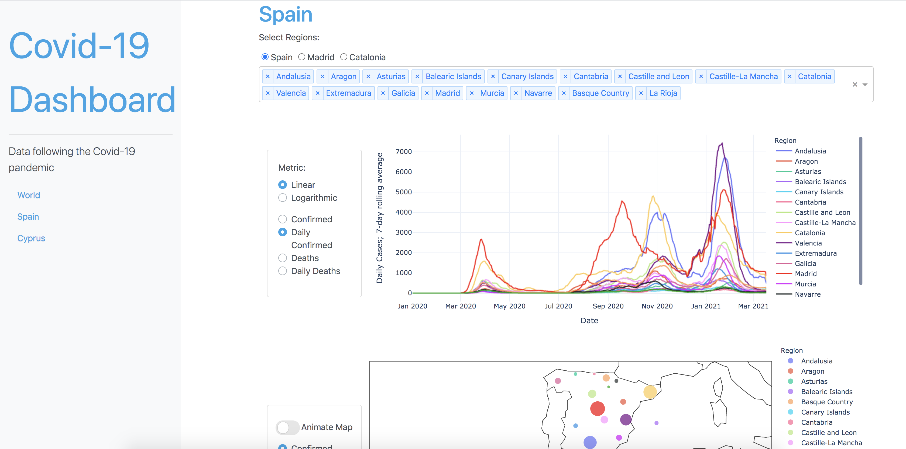
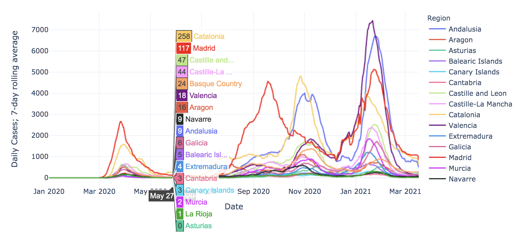
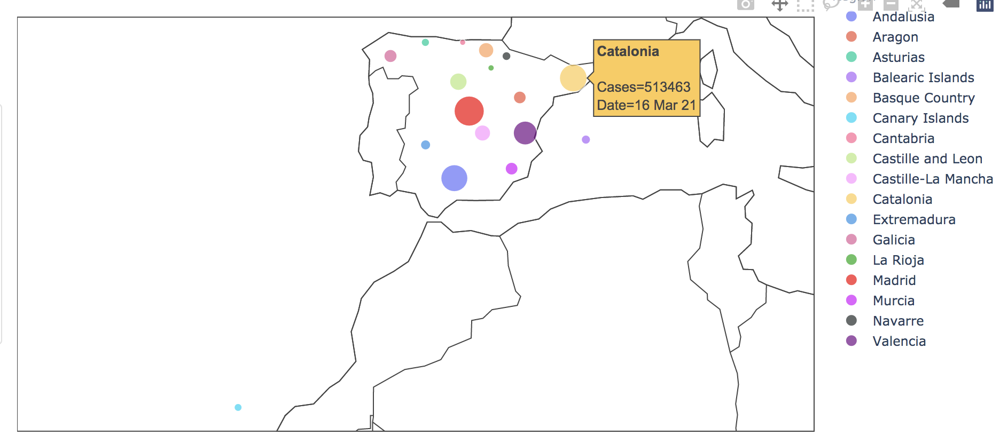
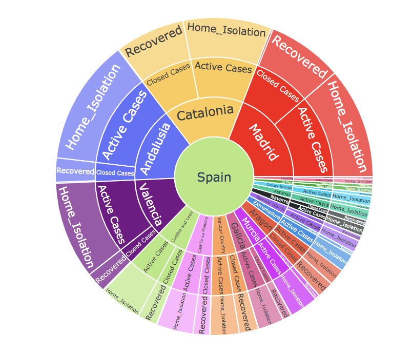
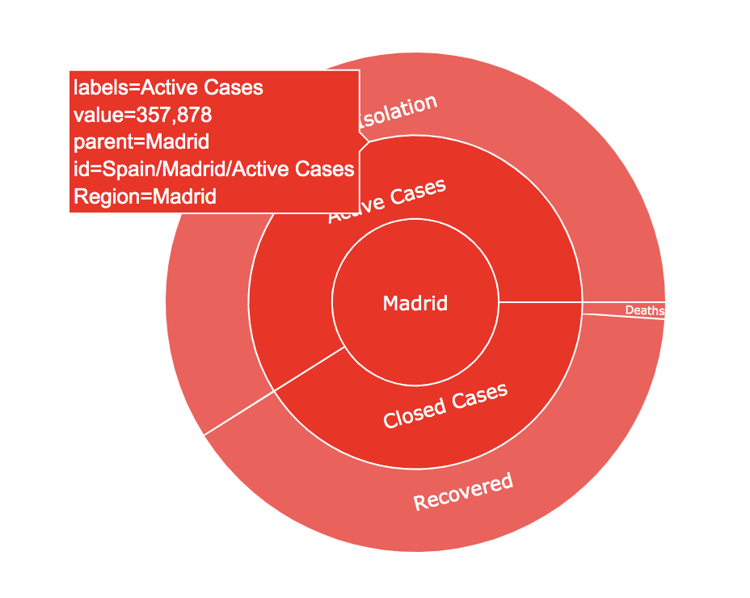

# Coronavirus COVID-19 Dashboard

## About the app

Interactive dashboard following the covid19 outbreak in Spain.

## Built With

- [Dash](https://dash.plot.ly/) - Main server and interactive components
- [Plotly Python](https://plot.ly/python/) - Used to create the interactive plots

## Screenshots

The following are screenshots for the app in this repo:

